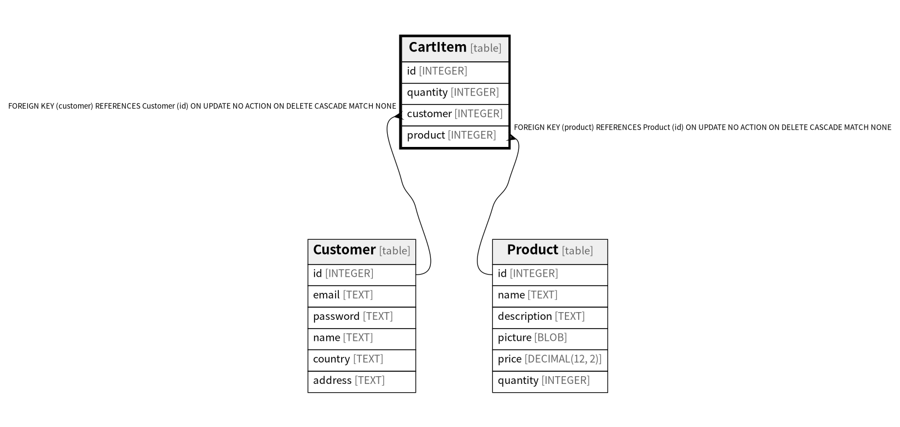

# CartItem

## Description

<details>
<summary><strong>Table Definition</strong></summary>

```sql
CREATE TABLE "CartItem" (
  "id" INTEGER PRIMARY KEY AUTOINCREMENT,
  "quantity" INTEGER NOT NULL,
  "customer" INTEGER NOT NULL REFERENCES "Customer" ("id") ON DELETE CASCADE,
  "product" INTEGER NOT NULL REFERENCES "Product" ("id") ON DELETE CASCADE
)
```

</details>

## Columns

| Name | Type | Default | Nullable | Children | Parents | Comment |
| ---- | ---- | ------- | -------- | -------- | ------- | ------- |
| id | INTEGER |  | true |  |  |  |
| quantity | INTEGER |  | false |  |  |  |
| customer | INTEGER |  | false |  | [Customer](Customer.md) |  |
| product | INTEGER |  | false |  | [Product](Product.md) |  |

## Constraints

| Name | Type | Definition |
| ---- | ---- | ---------- |
| id | PRIMARY KEY | PRIMARY KEY (id) |
| - (Foreign key ID: 0) | FOREIGN KEY | FOREIGN KEY (product) REFERENCES Product (id) ON UPDATE NO ACTION ON DELETE CASCADE MATCH NONE |
| - (Foreign key ID: 1) | FOREIGN KEY | FOREIGN KEY (customer) REFERENCES Customer (id) ON UPDATE NO ACTION ON DELETE CASCADE MATCH NONE |

## Indexes

| Name | Definition |
| ---- | ---------- |
| idx_cartitem__product | CREATE INDEX "idx_cartitem__product" ON "CartItem" ("product") |
| idx_cartitem__customer | CREATE INDEX "idx_cartitem__customer" ON "CartItem" ("customer") |

## Relations



---

> Generated by [tbls](https://github.com/k1LoW/tbls)
