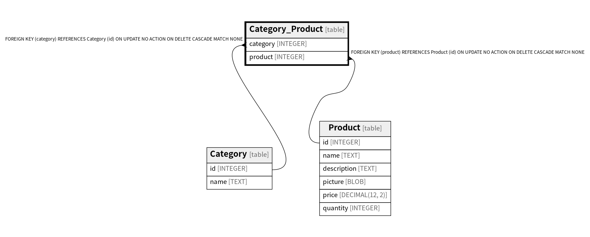

# Category_Product

## Description

<details>
<summary><strong>Table Definition</strong></summary>

```sql
CREATE TABLE "Category_Product" (
  "category" INTEGER NOT NULL REFERENCES "Category" ("id") ON DELETE CASCADE,
  "product" INTEGER NOT NULL REFERENCES "Product" ("id") ON DELETE CASCADE,
  PRIMARY KEY ("category", "product")
)
```

</details>

## Columns

| Name | Type | Default | Nullable | Children | Parents | Comment |
| ---- | ---- | ------- | -------- | -------- | ------- | ------- |
| category | INTEGER |  | false |  | [Category](Category.md) |  |
| product | INTEGER |  | false |  | [Product](Product.md) |  |

## Constraints

| Name | Type | Definition |
| ---- | ---- | ---------- |
| category | PRIMARY KEY | PRIMARY KEY (category) |
| product | PRIMARY KEY | PRIMARY KEY (product) |
| - (Foreign key ID: 0) | FOREIGN KEY | FOREIGN KEY (product) REFERENCES Product (id) ON UPDATE NO ACTION ON DELETE CASCADE MATCH NONE |
| - (Foreign key ID: 1) | FOREIGN KEY | FOREIGN KEY (category) REFERENCES Category (id) ON UPDATE NO ACTION ON DELETE CASCADE MATCH NONE |
| sqlite_autoindex_Category_Product_1 | PRIMARY KEY | PRIMARY KEY (category, product) |

## Indexes

| Name | Definition |
| ---- | ---------- |
| idx_category_product | CREATE INDEX "idx_category_product" ON "Category_Product" ("product") |
| sqlite_autoindex_Category_Product_1 | PRIMARY KEY (category, product) |

## Relations



---

> Generated by [tbls](https://github.com/k1LoW/tbls)
