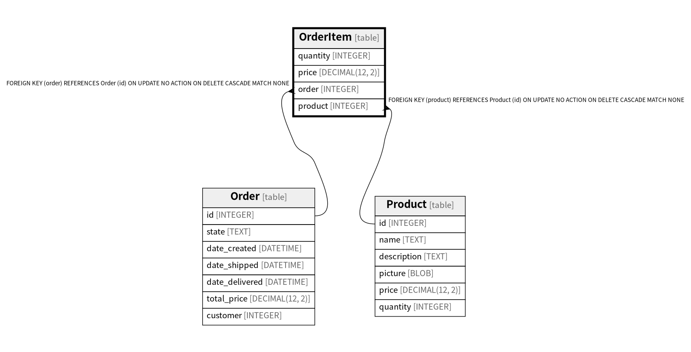

# OrderItem

## Description

<details>
<summary><strong>Table Definition</strong></summary>

```sql
CREATE TABLE "OrderItem" (
  "quantity" INTEGER NOT NULL,
  "price" DECIMAL(12, 2) NOT NULL,
  "order" INTEGER NOT NULL REFERENCES "Order" ("id") ON DELETE CASCADE,
  "product" INTEGER NOT NULL REFERENCES "Product" ("id") ON DELETE CASCADE,
  PRIMARY KEY ("order", "product")
)
```

</details>

## Columns

| Name | Type | Default | Nullable | Children | Parents | Comment |
| ---- | ---- | ------- | -------- | -------- | ------- | ------- |
| quantity | INTEGER |  | false |  |  |  |
| price | DECIMAL(12, 2) |  | false |  |  |  |
| order | INTEGER |  | false |  | [Order](Order.md) |  |
| product | INTEGER |  | false |  | [Product](Product.md) |  |

## Constraints

| Name | Type | Definition |
| ---- | ---- | ---------- |
| order | PRIMARY KEY | PRIMARY KEY (order) |
| product | PRIMARY KEY | PRIMARY KEY (product) |
| - (Foreign key ID: 0) | FOREIGN KEY | FOREIGN KEY (product) REFERENCES Product (id) ON UPDATE NO ACTION ON DELETE CASCADE MATCH NONE |
| - (Foreign key ID: 1) | FOREIGN KEY | FOREIGN KEY (order) REFERENCES Order (id) ON UPDATE NO ACTION ON DELETE CASCADE MATCH NONE |
| sqlite_autoindex_OrderItem_1 | PRIMARY KEY | PRIMARY KEY (order, product) |

## Indexes

| Name | Definition |
| ---- | ---------- |
| idx_orderitem__product | CREATE INDEX "idx_orderitem__product" ON "OrderItem" ("product") |
| sqlite_autoindex_OrderItem_1 | PRIMARY KEY (order, product) |

## Relations



---

> Generated by [tbls](https://github.com/k1LoW/tbls)
