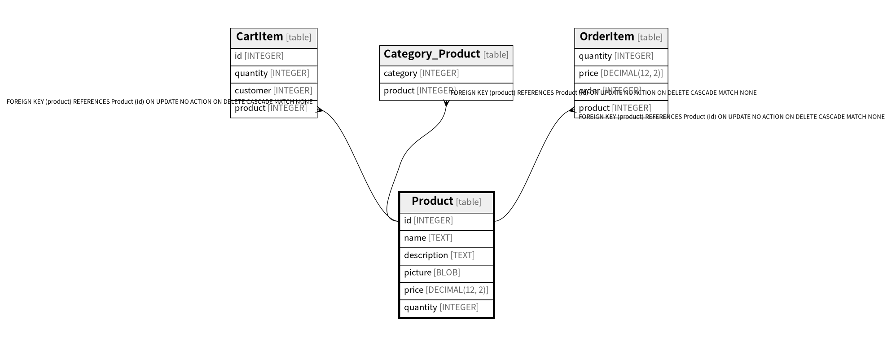

# Product

## Description

<details>
<summary><strong>Table Definition</strong></summary>

```sql
CREATE TABLE "Product" (
  "id" INTEGER PRIMARY KEY AUTOINCREMENT,
  "name" TEXT NOT NULL,
  "description" TEXT NOT NULL,
  "picture" BLOB,
  "price" DECIMAL(12, 2) NOT NULL,
  "quantity" INTEGER NOT NULL
)
```

</details>

## Columns

| Name | Type | Default | Nullable | Children | Parents | Comment |
| ---- | ---- | ------- | -------- | -------- | ------- | ------- |
| id | INTEGER |  | true | [CartItem](CartItem.md) [Category_Product](Category_Product.md) [OrderItem](OrderItem.md) |  |  |
| name | TEXT |  | false |  |  |  |
| description | TEXT |  | false |  |  |  |
| picture | BLOB |  | true |  |  |  |
| price | DECIMAL(12, 2) |  | false |  |  |  |
| quantity | INTEGER |  | false |  |  |  |

## Constraints

| Name | Type | Definition |
| ---- | ---- | ---------- |
| id | PRIMARY KEY | PRIMARY KEY (id) |

## Relations



---

> Generated by [tbls](https://github.com/k1LoW/tbls)
