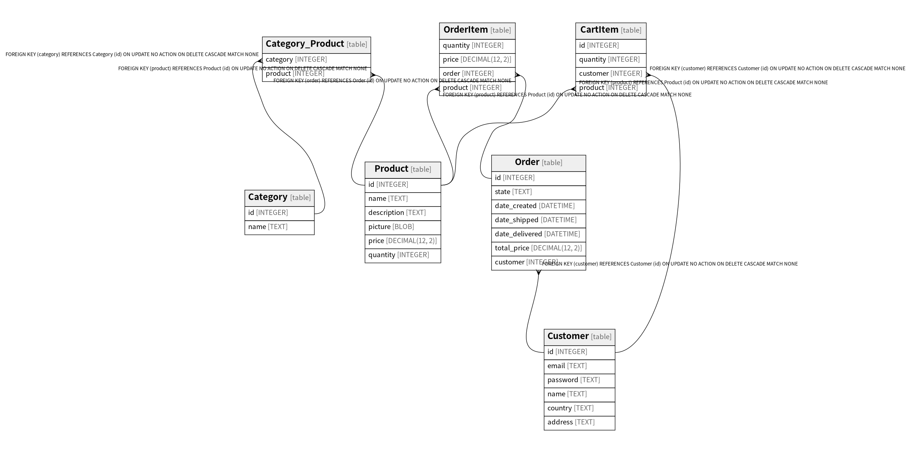

# estore.sqlite

## Tables

| Name | Columns | Comment | Type |
| ---- | ------- | ------- | ---- |
| [Category](Category.md) | 2 |  | table |
| [Customer](Customer.md) | 6 |  | table |
| [Order](Order.md) | 7 |  | table |
| [Product](Product.md) | 6 |  | table |
| [CartItem](CartItem.md) | 4 |  | table |
| [Category_Product](Category_Product.md) | 2 |  | table |
| [OrderItem](OrderItem.md) | 4 |  | table |

## Relations

---

> Generated by [tbls](https://github.com/k1LoW/tbls)
